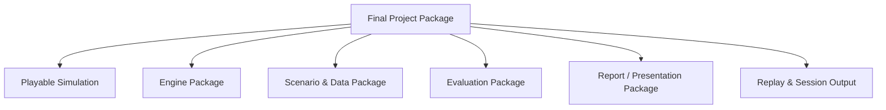
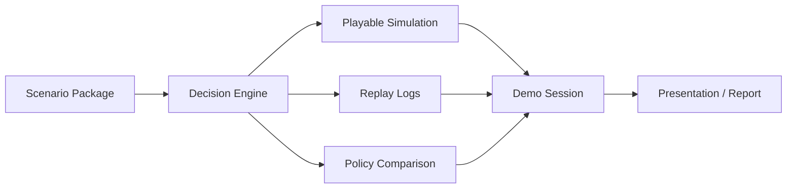

# 최종 산출물 문서: Final Deliverables Specification

## 0. 문서 목적

본 문서는 프로젝트 최종 단계에서 **무엇을 제출하고, 무엇을 시연하며, 각 산출물 안에 어떤 내용이 들어가야 하는지**를 정의한다.

범위:
- 기술 산출물
- 플레이 가능한 산출물
- 설명/보고 산출물
- 데모 흐름
- 평가용 산출물
- 저장/재현 가능한 패키지

비범위:
- 시각 디자인 스타일 상세
- UI 화면 미적 요소
- 브랜딩 가이드

---

## 1. 산출물 구성 원칙

최종 산출물은 단일 파일 하나가 아니라, 아래 세 층으로 묶인 **프로젝트 패키지**여야 한다.

1. **기술적 산출물**
   - 엔진 정의와 내부 로직
2. **인터랙티브 산출물**
   - 플레이 가능한 시뮬레이션
3. **설명/평가 산출물**
   - 결과 해석, 비교, 보고

즉 “최종 결과”는 웹게임 그 자체가 아니라,  
그 웹게임이 어떤 구조로 작동하고, 어떤 의미를 전달하며, 어떤 결과를 남기는지까지 포함한다.

---

## 2. 최종 산출물 맵



### 2.1 구성 설명
- `Playable Simulation`: 사용자가 실제로 플레이하는 것
- `Engine Package`: 내부 로직을 설명하는 기술물
- `Scenario & Data Package`: 어떤 세계에서 게임이 돌아가는지 정의
- `Evaluation Package`: 결과 비교와 실험 정리
- `Report / Presentation Package`: 발표와 전달용 자료
- `Replay & Session Output`: 세션 결과물과 로그

---

## 3. 산출물 1 — Playable Simulation

### 목적
프로젝트의 핵심 경험을 직접 체험하게 만드는 산출물

### 반드시 포함되어야 하는 내용
- 시나리오 선택 또는 시나리오 고정 진입
- 턴 기반 진행
- 현재 상태 표시
- 이벤트 제시
- 전략 선택
- 결과 반영
- 다음 턴 진행
- 플레이 종료 후 결과 확인

### 기능 관점 핵심
- 플레이어가 한 턴에 하나의 전략을 선택할 수 있어야 한다.
- 선택 결과가 상태 변화로 연결되어야 한다.
- 동일 플레이가 replay 가능한 구조여야 한다.
- 사람의 선택과 기준 정책의 차이를 기록할 수 있어야 한다.

### 산출물 형태
- 실행 가능한 웹 시뮬레이션
- 또는 데모 가능한 프로토타입 앱

### 완료 기준
- 최소 1개 이상의 시나리오가 끝까지 플레이 가능
- 최소 1개 이상의 기준 정책 비교 가능
- 세션 종료 후 결과 요약 생성 가능

---

## 4. 산출물 2 — Engine Package

### 목적
프로젝트의 핵심 계산 구조를 설명하고 재현 가능하게 만드는 산출물

### 반드시 포함되어야 하는 내용
- 상태 변수 정의
- 액션 카탈로그
- 이벤트 카탈로그
- 보상 구조
- 전이 로직
- 턴 루프
- 정책 비교 방식
- 로그 포맷

### 포함되면 좋은 내용
- pseudo-code
- API spec
- JSON contract
- calibration pipeline 설명
- safety/action mask 규칙

### 산출물 형태
- technical design document
- 코드 구조 설명서
- 내부 로직 다이어그램

### 완료 기준
- 타인이 문서를 보고 엔진 구조를 이해할 수 있음
- 세션이 어떤 순서로 처리되는지 명확히 드러남
- 정책 비교가 어디서 계산되는지 설명 가능

---

## 5. 산출물 3 — Scenario & Data Package

### 목적
게임이 어떤 세계에서 돌아가는지, 어떤 가정이 들어갔는지 정의하는 산출물

### 반드시 포함되어야 하는 내용
- 시나리오 설명서
- 초기 상태 정의
- 액션별 효과 가정
- 이벤트 발생 규칙
- reward weight 설정
- 락인 강/약 시나리오 차이점
- 데이터 보정(calibration) 출처와 방식 요약

### 포함되면 좋은 내용
- 세그먼트 정의
- hidden variable 의미 설명
- 시나리오별 추천 플레이 스타일

### 산출물 형태
- scenario spec markdown/json
- calibration note
- assumptions table

### 완료 기준
- 어떤 가정으로 시뮬레이터가 움직이는지 투명하게 설명됨
- 두 시나리오 이상 비교 가능
- 오프라인 데이터가 어디에 반영되었는지 추적 가능

---

## 6. 산출물 4 — Evaluation Package

### 목적
엔진과 플레이 결과가 어떤 의미를 가지는지 비교/검증하는 산출물

### 반드시 포함되어야 하는 내용
- baseline policy vs user policy 비교
- 시나리오별 결과 비교
- reward decomposition 예시
- regret / value gap 요약
- 주요 플레이 패턴 해석
- sanity check 또는 validation note

### 포함되면 좋은 내용
- ablation note
- action usage histogram
- replay-based case study
- “왜 이 전략이 장기적으로 유리한가” 설명

### 산출물 형태
- evaluation report
- metrics table
- turn-by-turn comparison log

### 완료 기준
- 단순 플레이 로그가 아니라 분석 결과가 존재함
- 플레이어 전략과 기준 정책 차이를 설명 가능
- 시뮬레이터가 완전히 랜덤 장난감이 아님을 보여줌

---

## 7. 산출물 5 — Report / Presentation Package

### 목적
프로젝트를 타인에게 전달하고 설득하는 산출물

### 반드시 포함되어야 하는 내용
- 문제 정의
- 왜 churn prediction만으로 부족한가
- 왜 sequential decision framing이 필요한가
- 엔진 요약
- 시나리오 구조
- 데모 흐름
- 핵심 결과
- 프로젝트 메시지

### 포함되면 좋은 내용
- mermaid diagrams
- replay screenshot or log excerpt
- final insight summary
- 향후 확장 방향

### 산출물 형태
- 발표 자료
- 프로젝트 소개 문서
- README / overview document

### 완료 기준
- 기술을 모르는 청중도 프로젝트 목적을 이해할 수 있음
- 기술을 아는 청중도 구조의 타당성을 이해할 수 있음
- 데모와 문서가 같은 메시지를 말함

---

## 8. 산출물 6 — Replay & Session Output

### 목적
한 번의 플레이가 독립적인 결과물로 남도록 만드는 산출물

### 반드시 포함되어야 하는 내용
- 세션 메타데이터
- 턴별 이벤트
- 턴별 선택 액션
- 상태 변화
- reward component
- 기준 정책 추천값
- 최종 결과 요약

### 포함되면 좋은 내용
- 플레이 스타일 라벨
- 잘한 턴 / 아쉬운 턴 요약
- 주요 turning point 요약

### 산출물 형태
- JSONL replay
- session summary json
- human-readable summary markdown

### 완료 기준
- 특정 세션을 재생하거나 재해석할 수 있음
- 발표 중 “이 플레이에서는 왜 이렇게 됐는가”를 되짚을 수 있음

---

## 9. 최종 데모에서 보여줘야 하는 내용

최종 데모는 단순히 웹게임을 클릭해보는 수준이 아니라, 아래 서사 구조를 가져야 한다.

### Act 1 — 문제 제시
- retention은 단순 예측 문제가 아니라는 점 설명
- 상태 기반 의사결정이라는 프레임 제시

### Act 2 — 시나리오 소개
- 어떤 기업/서비스 상황인지 설명
- 락인 강/약 같은 맥락 소개

### Act 3 — 플레이
- 몇 턴 동안 실제 전략 선택 수행
- 상태/결과 변화 확인

### Act 4 — 비교
- 기준 정책이 어떤 선택을 했는지 비교
- 왜 차이가 났는지 설명

### Act 5 — 해석
- 플레이어가 어떤 CEO였는지
- 어떤 전략이 장기적으로 더 좋았는지
- 프로젝트가 말하고자 하는 메시지 회수

---

## 10. 데모 패키지 의존 관계



### 10.1 해석
최종 발표에서 보이는 플레이는 단독 산출물이 아니라,
- 시나리오 정의
- 엔진
- 기준 정책
- 로그
- 설명 자료

가 결합된 결과물이다.

---

## 11. 최종 제출 파일/폴더 예시

```text
/project
  /docs
    project_description.md
    engine_technical_design.md
    final_deliverables_spec.md
  /scenarios
    lockin_strong.json
    lockin_weak.json
    assumptions.md
  /engine
    state.py
    transition.py
    reward.py
    policy.py
    session.py
  /replay
    sample_session.jsonl
    sample_summary.json
  /evaluation
    policy_comparison.md
    sanity_checks.md
  /demo
    demo_script.md
    presentation_outline.md
```

이 구조는 예시이며, 중요한 것은 **문서 / 엔진 / 시나리오 / 로그 / 평가**가 분리되어 있다는 점이다.

---

## 12. 산출물 매트릭스

| 산출물 | 핵심 내용 | 주요 독자 | 질문에 대한 답 |
|---|---|---|---|
| Playable Simulation | 턴 기반 전략 플레이 | 체험자/심사자 | “직접 해보면 어떤가?” |
| Engine Package | 내부 로직과 상태 전이 | 엔지니어/연구자 | “어떻게 돌아가는가?” |
| Scenario & Data Package | 가정과 보정 정보 | 리뷰어/기획자 | “무엇을 기반으로 만들었나?” |
| Evaluation Package | 비교와 해석 | 연구자/발표 청중 | “결과가 의미 있는가?” |
| Report / Presentation | 스토리와 메시지 | 일반 청중/심사자 | “왜 이 프로젝트가 중요한가?” |
| Replay & Session Output | 플레이 결과 기록 | 발표자/분석자 | “이 플레이에서 무슨 일이 있었나?” |

---

## 13. 최종 체크리스트

### 필수 체크
- [ ] 기술 문서가 존재한다.
- [ ] 프로젝트 설명 문서가 존재한다.
- [ ] 최종 산출물 정의 문서가 존재한다.
- [ ] 최소 1개 이상 플레이 가능한 시나리오가 있다.
- [ ] 세션 로그가 남는다.
- [ ] 기준 정책 비교가 가능하다.
- [ ] 발표용 스크립트가 존재한다.
- [ ] 결과 해석 문장이 준비되어 있다.

### 있으면 좋은 체크
- [ ] 2개 이상 시나리오 비교 가능
- [ ] LLM 해설 로그 저장 가능
- [ ] replay 기반 case study 준비
- [ ] sample session 결과 패키지 포함

---

## 14. 최종 정의

이 프로젝트의 최종 산출물은 아래 한 문장으로 요약할 수 있다.

> **A documented simulation project package that includes a retention decision engine, a playable strategy simulator, scenario definitions, replayable session outputs, and an evaluation/report layer.**

즉 최종적으로 제출되는 것은:
- 게임 하나
- 문서 하나

가 아니라,

- 작동 가능한 시뮬레이션
- 이를 설명하는 기술 구조
- 시나리오 정의
- 플레이 결과 로그
- 정책 비교 및 평가
- 발표 가능한 메시지

를 모두 포함하는 **완결된 프로젝트 패키지**다.
